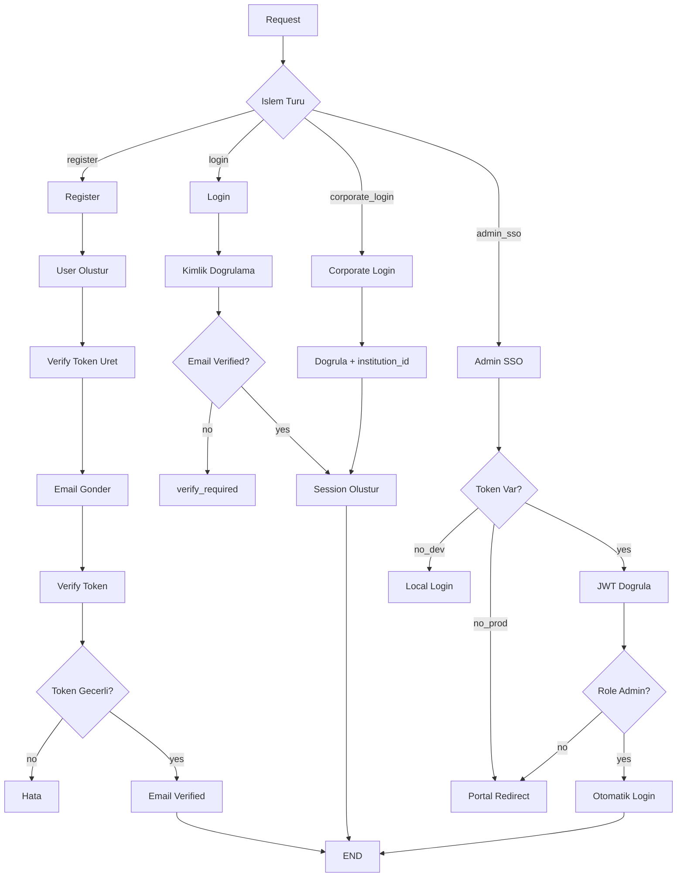

```mermaid
flowchart TB
    A["Request"] --> B{"Islem Turu"}
    B -- register --> R1["Register"]
    R1 --> R2["User Olustur"]
    R2 --> R3["Verify Token Uret"]
    R3 --> R4["Email Gonder"]
    R4 --> V1["Verify Token"]
    V1 --> V2{"Token Gecerli?"}
    V2 -- no --> VERR["Hata"]
    V2 -- yes --> V3["Email Verified"]
    V3 --> END["END"]
    B -- login --> L1["Login"]
    L1 --> L2["Kimlik Dogrulama"]
    L2 --> L3{"Email Verified?"}
    L3 -- no --> VREQ["verify_required"]
    L3 -- yes --> L4["Session Olustur"]
    L4 --> END
    B -- corporate_login --> C1["Corporate Login"]
    C1 --> C2["Dogrula + institution_id"]
    C2 --> L4
    B -- admin_sso --> S1["Admin SSO"]
    S1 --> S2{"Token Var?"}
    S2 -- no_dev --> SDEV["Local Login"]
    S2 -- no_prod --> SPROD["Portal Redirect"]
    S2 -- yes --> S3["JWT Dogrula"]
    S3 --> S4{"Role Admin?"}
    S4 -- no --> SPROD
    S4 -- yes --> S5["Otomatik Login"]
    S5 --> END
```
