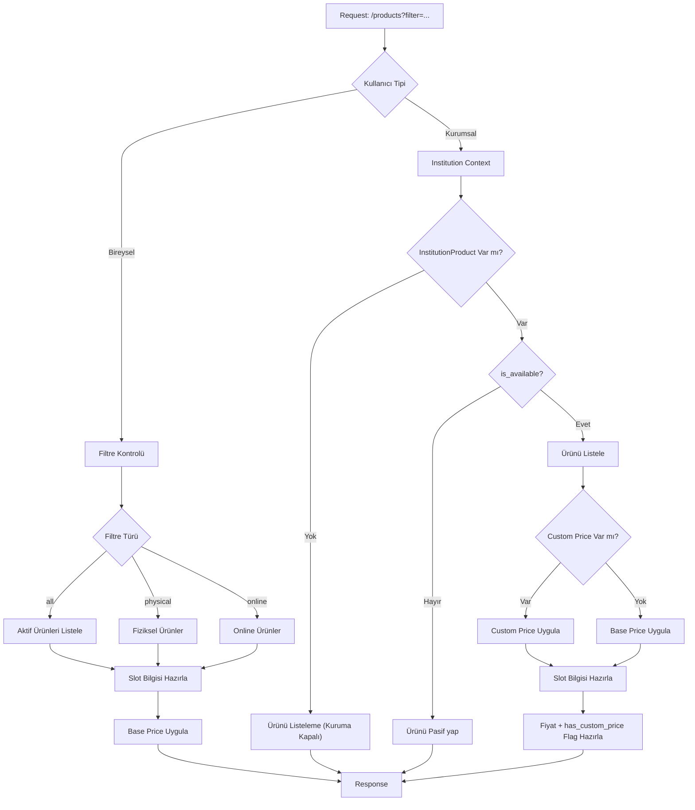

```mermaid
 flowchart TB
    A["Request: /products?filter=..."] --> B{"Kullanıcı Tipi"}
    B -- Bireysel --> C["Filtre Kontrolü"]
    C --> D{"Filtre Türü"}
    D -- all --> E["Aktif Ürünleri Listele"]
    D -- physical --> F["Fiziksel Ürünler"]
    D -- online --> G["Online Ürünler"]
    E --> H["Slot Bilgisi Hazırla"]
    F --> H
    G --> H
    H --> I["Base Price Uygula"]
    I --> Z["Response"]
    B -- Kurumsal --> K["Institution Context"]
    K --> L{"InstitutionProduct Var mı?"}
    L -- Yok --> X["Ürünü Listeleme (Kuruma Kapalı)"]
    X --> Z
    L -- Var --> O{"is_available?"}
    O -- Hayır --> P["Ürünü Pasif yap"]
    P --> Z
    O -- Evet --> Q["Ürünü Listele"]
    Q --> R{"Custom Price Var mı?"}
    R -- Var --> M["Custom Price Uygula"]
    R -- Yok --> N["Base Price Uygula"]
    M --> S["Slot Bilgisi Hazırla"]
    N --> S
    S --> T["Fiyat + has_custom_price Flag Hazırla"]
    T --> Z

```
