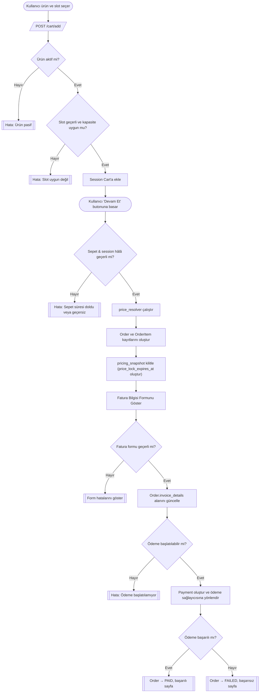

```mermaid
flowchart TB

A(["Kullanıcı ürün ve slot seçer"]) --> B[/"POST /cart/add"/]

B --> C{"Ürün aktif mi?"}
C -- Hayır --> E1[["Hata: Ürün pasif"]]
C -- Evet --> D{"Slot geçerli ve kapasite uygun mu?"}

D -- Hayır --> E2[["Hata: Slot uygun değil"]]
D -- Evet --> F["Session Cart'a ekle"]

F --> G(["Kullanıcı 'Devam Et' butonuna basar"])

G --> H{"Sepet & session hâlâ geçerli mi?"}
H -- Hayır --> E3[["Hata: Sepet süresi doldu veya geçersiz"]]
H -- Evet --> I["price_resolver çalıştır"]

I --> J["Order ve OrderItem kayıtlarını oluştur"]
J --> K["pricing_snapshot kilitle (price_lock_expires_at oluştur)"]

K --> L["Fatura Bilgisi Formunu Göster"]

L --> M{"Fatura formu geçerli mi?"}
M -- Hayır --> E4[["Form hatalarını göster"]]
M -- Evet --> N["Order.invoice_details alanını güncelle"]

N --> O{"Ödeme başlatılabilir mi?"}
O -- Hayır --> E5[["Hata: Ödeme başlatılamıyor"]]
O -- Evet --> P["Payment oluştur ve ödeme sağlayıcısına yönlendir"]

P --> Q{"Ödeme başarılı mı?"}
Q -- Evet --> R[["Order → PAID, başarılı sayfa"]]
Q -- Hayır --> S[["Order → FAILED, başarısız sayfa"]]

%% Gereksiz node temizlendi
```
